# Clean Energy Graveyard (C.E.G)

An interactive map and analysis tool tracking cancelled renewable energy projects across the UK. Built using the government's [Renewable Energy Planning Database (REPD)](https://www.gov.uk/government/publications/renewable-energy-planning-database-monthly-extract), it visualises refused and withdrawn planning applications alongside AI-generated analysis of community opposition patterns.

## What It Does

- **Interactive Map** -- Browse 156+ cancelled renewable energy projects (solar, wind, battery storage) plotted on a MapLibre GL map of the UK
- **NIMBY Analysis** -- AI-generated scoring of community opposition levels, with confidence ratings, sourced news articles, and tongue-in-cheek commentary
- **Filtering** -- Filter projects by technology type (Solar, Wind, Battery, Other) and date range (2020-2025)
- **Local Authority Layers** -- View local authority boundaries colour-coded by project density, with click-to-zoom
- **Project Details** -- Click any project to see capacity, planning references, links to council planning portals, and related news articles
- **Delay Visualisation** -- Charts showing average time before project cancellation

## Project Structure

```
repd_map/
├── frontend/          # SvelteKit web application
│   ├── src/
│   │   ├── routes/    # Page routing (+page.svelte, +page.js)
│   │   └── lib/
│   │       ├── Map.svelte              
│   │       ├── components/
│   │       │   ├── About.svelte
│   │       │   ├── DelayTimesVisualization.svelte
│   │       │   ├── Timeline.svelte     # Date range slider
│   │       │   ├── map/
│   │       │   └── sidebar/
│   │       │       ├── SideBarMain.svelte
│   │       │       ├── SelectedFeatureUI.svelte
│   │       │       ├── ChatElement.svelte
│   │       │       └── BentoBox.svelte
│   │       └── utils/
│   │           ├── mapUtils.js
│   │           └── clipboard.js
│   └── static/        # GeoJSON data, NIMBY scores, council mmappings
├── backend/           # Python data pipeline
│   ├── main.py
│   ├── src/
│   │   ├── clients.py             # API clients (Gemini, Anthropic)
│   │   ├── prompts.py             # LLM prompt templates
│   │   ├── processors/            # REPD data processing
│   │   └── data/                  # Raw REPD CSV data
│   ├── scripts/                   # Batch processing scripts
│   ├── tests/
│   └── outputs/
|   |__ XX_notebook.ipynb          # Notebooks for agent analysis instructions.
└── archive/           # Previous iterations
```

## Backend Pipeline

```mermaid
flowchart TD
    REPD[(REPD Dataset <br> Ground Truth)] -->|Load & filter<br>cancelled projects| Processor[REPDProcessor]
    Processor -->|Project context| Agent[NimbyAgent]

    Agent --> Analyse[Stage 1: NIMBY Analysis<br>Claude · prompt_nimby_analysis]
    Agent --> Search[Stage 2: Article Search<br>Claude Web Search · prompt_researcher]
    Agent --> Council[Stage 3: Council Website Finder 🚧]

    Analyse -->|NimbyFormat JSON| Eval[Evaluator<br>Claude · prompt_evaluator]
    Search -->|WebResponse JSON<br>article URLs + summary| Eval
    Council -.->|Planning portal URLs| Eval

    Eval -->|Accuracy & certainty scores| Output[/nimby_score.json<br>points.geojson/]
    Output -->|Static assets| Frontend[SvelteKit Frontend]

    style REPD fill:#2d6a4f,color:#fff
    style Analyse fill:#eb8e47,color:#fff
    style Search fill:#eb8e47,color:#fff
    style Council fill:#6c757d,color:#fff,stroke-dasharray: 5 5
    style Eval fill:#b62121,color:#fff
    style Output fill:#004C99,color:#fff
    style Frontend fill:#E6B800,color:#000
```



> 🚧 = planned / in development

## Tech Stack

### Frontend
- **Framework:** SvelteKit 2 / Svelte 5
- **Mapping:** MapLibre GL with MapTiler basemaps
- **Charts:** Chart.js, D3
- **Styling:** Tailwind CSS 4, DaisyUI, shadcn-svelte
- **Animation:** GSAP

### Backend
- **Language:** Python 3.11+
- **AI:** Google Gemini, Anthropic Claude (for NIMBY analysis)
- **Data:** pandas, GeoPandas
- **API:** FastAPI

## Getting Started

### Prerequisites

- Node.js 18+
- Python 3.11+
- A [MapTiler API key](https://www.maptiler.com/) (free tier works)

### Frontend

```bash
cd frontend
npm install
npm run dev
```

The app will be available at `http://localhost:5173`.

### Backend

```bash
cd backend
pip install -e .       # or: uv sync
python main.py
```

## Data Sources

| File | Description |
|------|-------------|
| `points.geojson` | Cancelled renewable project locations and metadata |
| `nimby_score.json` | AI-generated opposition analysis per project |
| `councils.json` | Planning authority name to planning portal URL mapping |
| `localauth.json` | Local authority boundary geometries (GeoJSON) |
| `final.json` | Aggregated statistics |
| `df_refused.json` | Refused project timing data |
| `df_withdrawn.json` | Withdrawn project timing data |

The upstream data comes from the UK Government's REPD quarterly extract, filtered to projects with status "Planning Permission Refused" or "Planning Application Withdrawn" submitted since January 2020.

## Disclaimer

The project data (site locations, capacities, planning references) comes from the official REPD dataset and is factual. The NIMBY analysis, scores, and commentary are AI-generated and should not be treated as authoritative. As the app puts it: *"The opinions themselves are made up, and the points don't matter."*

## Author

[Damian Bemben](https://www.bemben.co.uk)

## Licence

This project is not currently licensed for redistribution. All rights reserved.
